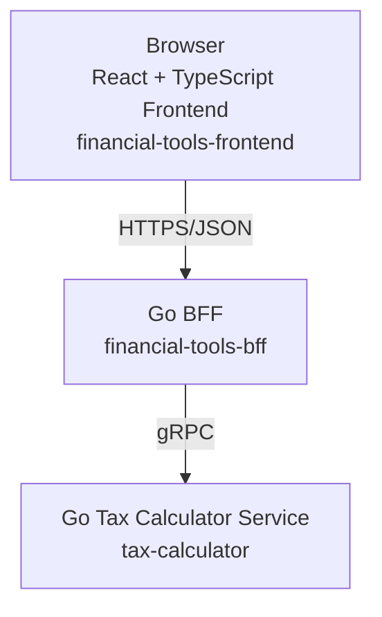

# financial-tools

Financial Tools is a cloud-native application with a React frontend, a Go BFF, and a Go tax-calculator microservice.

## Architecture



### Why the BFF exists

The BFF provides a stable frontend-facing JSON API and isolates browser concerns (request validation, HTTP errors, payload shaping) from backend service contracts. The tax-calculator service stays focused on tax domain logic and gRPC contracts.

## Repository structure

```text
frontend/                    # React + TypeScript + Vite frontend
services/
  bff/                       # Go HTTP BFF that calls tax-calculator via gRPC
  tax-calculator/            # Go gRPC tax domain service
proto/
  tax/tax.proto              # Protobuf contract
gen/
  go/                        # Generated Go protobuf/grpc code
  typescript/                # Generated TypeScript protobuf types
terraform/                   # GCP infrastructure (Cloud Run, Artifact Registry)
.github/workflows/           # Service-specific CI/CD + Terraform workflow
docker-compose.yml           # Local full-stack development
```

## Services

### Frontend (`financial-tools-frontend`)
- React + TypeScript + Vite
- Calls BFF via `/api/tax/calculate`
- No business tax logic in UI

### BFF (`financial-tools-bff`)
- Go HTTP server
- Endpoint: `POST /api/tax/calculate`
- Validates request shape and proxies to tax-calculator via gRPC
- Maps gRPC errors to HTTP status codes
- No tax business logic

### Tax calculator (`tax-calculator`)
- Go gRPC service
- Owns tax calculation domain logic
- Transport handlers delegate to internal domain package

## Protobuf and gRPC

Contract file:
- `proto/tax/tax.proto`

Generate code:

```bash
cd frontend && npm install && cd ..
sudo apt-get install -y protobuf-compiler
scripts/generate-proto.sh
```

Generated outputs:
- Go: `gen/go/tax/*.go`
- TypeScript: `gen/typescript/tax.ts`

Do not edit generated files manually.

## Local development

### Option 1: run each service directly

```bash
# terminal 1
cd services/tax-calculator
go run ./cmd/server

# terminal 2
cd services/bff
TAX_CALCULATOR_GRPC_TARGET=localhost:8080 go run ./cmd/server

# terminal 3
cd frontend
npm install
npm run dev
```

Frontend dev server: http://localhost:5173

### Option 2: Docker Compose

```bash
docker compose up --build
```

Frontend: http://localhost:8080

## Docker

- `frontend/Dockerfile`
- `services/bff/Dockerfile`
- `services/tax-calculator/Dockerfile`

All containers listen on the Cloud Run `PORT` environment variable.

## Terraform / GCP infrastructure

Terraform continues using the existing GCS remote backend in `terraform/versions.tf`.

Managed resources include:
- Artifact Registry repository (`financial-tools`)
- Cloud Run services:
  - `financial-tools-frontend`
  - `financial-tools-bff`
  - `tax-calculator`

Run locally:

```bash
cd terraform
terraform init
terraform plan
terraform apply
```

## Artifact Registry image naming

Images are pushed under repository `financial-tools` with image names:
- `financial-tools-frontend`
- `financial-tools-bff`
- `tax-calculator`

## GitHub Actions workflows

- `frontend.yml` – test/build/deploy frontend
- `bff.yml` – generate proto, test/build/deploy BFF
- `tax-calculator.yml` – generate proto, test/build/deploy tax service
- `terraform.yml` – fmt/validate/plan/apply Terraform on Terraform changes

Path filters are used so unrelated services are not rebuilt unnecessarily.

## Deployment process

1. Push service changes to `main`.
2. Service workflow builds + pushes image and deploys its Cloud Run service.
3. Terraform workflow runs when infrastructure code changes.

## Environment and secrets

GitHub Actions requires:
- `GCP_WORKLOAD_IDENTITY_PROVIDER`
- `GCP_SERVICE_ACCOUNT`

Terraform variables are defined in `terraform/variables.tf` and currently set in `terraform/terraform.tfvars`.
